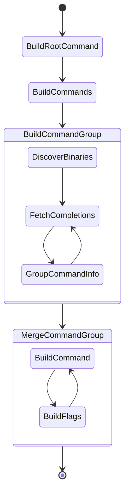

# POC: Binary Dispatcher

## Inspiration

- git (git-shell) -> `git shell`
- docker (docker-compose) -> `docker compose`
- app (app-sub, app-add) -> `app sub` and `app add`
- It is `composition pattern`

## Step composition pattern

1. `task build` to build `app-json` and `app-time` to `bin` directory
2. Run `./app get time now` or `./app get json`. They must show difference exec debug command

## Design

## Step Simple

1. `task build` to build modules and core binary
2. `PATH=$PWD:$PATH ./app add 1 1` to calculate additional
3. `PATH=$PWD:$PATH ./app sub 1 1` to calculate subtraction

## Notes

- Have to handle flag in different types (Using StringFlag = simple)
- Handle subcommand with recursion so RootCmd -> A (Subcmd) -> B (Subcmd) -> C (Exec here)
- Have to group command which has same subcommand after fetch from binaries
    - (get): [json, time]; json inside `app-json` and `app-time`
- Should handle appropriate way when `app-json` has `get json` and `app-time` also has `get json`
